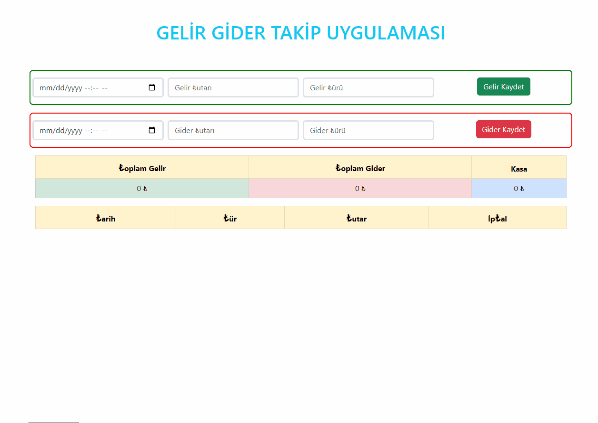

# BUDGET APP {HTML + CSS(BOOSTRAP) + JS}



## Description
This application aims to be able to calculate income and expense. Data is stored in LocaleStorage so that data is not lost. At the end of the transactions, the current balance is revealed.

## Project Skeleton 

```
BUDGET_APP(folder)
|
|----README.md
|----img(folder)
    |----images and gifs
|----index.html
|----style.css
|----script.js
```

## What I used in this project?

- ## HTML
  - ### FORM
- ## JS
  - ### LOCALESTORAGE
  - ### DOM
- ## CSS
  - ### Boostrap

<left> ⌛ Happy Coding  💻🎶🍕🍀✍ </left>